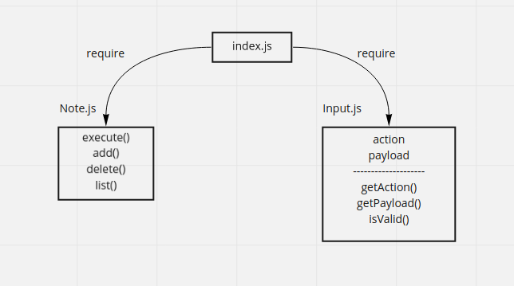

# notes

## Classes

<dl>
<dt><a href="#Input">Input</a></dt>
<dd></dd>
<dt><a href="#Note">Note</a></dt>
<dd></dd>
</dl>

## Functions

<dl>
<dt><a href="#getAction">getAction()</a> ⇒ <code>string</code></dt>
<dd>
[input getAction]

</dd>
<dt><a href="#getPayload">getPayload()</a> ⇒ <code>string</code></dt>
<dd>
[input getPayload]

</dd>
<dt><a href="#isValid">isValid()</a> ⇒ <code>Boolean</code></dt>
<dd>
[input check the isValid]

</dd>
<dt><a href="#execute">execute(action, payload)</a></dt>
<dd>
[execute]

</dd>
<dt><a href="#add">add(text, category)</a> ⇒ <code>Promise</code></dt>
<dd>
[add note]

</dd>
<dt><a href="#delete">delete(id)</a> ⇒ <code>Promise</code></dt>
<dd>
[delete note]

</dd>
<dt><a href="#list">list(category)</a> ⇒ <code>Promise</code></dt>
<dd>
[list notes]

</dd>
</dl>

## Input
**Kind**: global class  

### input.action
[action description]

**Kind**: instance property of [<code>Input</code>](#Input)  
**Properties**

| Name | Type |
| --- | --- |
| action | <code>string</code> |
| payload | <code>string</code> |

## Note
**Kind**: global class  

## getAction() ⇒ <code>string</code>
[input getAction]

**Kind**: global function  

## getPayload() ⇒ <code>string</code>
[input getPayload]

**Kind**: global function  

## isValid() ⇒ <code>Boolean</code>
[input check the isValid]

**Kind**: global function  

## execute(action, payload)
[execute]

**Kind**: global function  

| Param | Type | Description |
| --- | --- | --- |
| action | <code>string</code> | action type add || delete || list |
| payload | <code>string</code> | data |

## add(text, category) ⇒ <code>Promise</code>
[add note]

**Kind**: global function  

| Param | Type | Description |
| --- | --- | --- |
| text | <code>string</code> | note text |
| category | <code>string</code> | note category |

## delete(id) ⇒ <code>Promise</code>
[delete note]

**Kind**: global function  

| Param | Type | Description |
| --- | --- | --- |
| id | <code>number</code> | note id |

## list(category) ⇒ <code>Promise</code>
[list notes]

**Kind**: global function  

| Param | Type | Description |
| --- | --- | --- |
| category | <code>string</code> | [note category] |
=======
# notes-mongodb-app

## Input Functions

<dl>
<dt><a href="#constructor">constructor()</a></dt>
<dd>
[constructor input]

</dd>
<dt><a href="#getAction">getAction()</a> ⇒ <code>string</code></dt>
<dd>
[getAction description]

</dd>
<dt><a href="#getPayload">getPayload()</a> ⇒ <code>string</code></dt>
<dd>
[getPayload description]

</dd>
<dt><a href="#isValid">isValid()</a> ⇒ <code>Boolean</code></dt>
<dd>
[isValid description]

</dd>
</dl>

## constructor()
[constructor input]

**Kind**: global function  

## getAction() ⇒ <code>string</code>
[getAction description]

**Kind**: global function  
**Returns**: <code>string</code> - [description]  

## getPayload() ⇒ <code>string</code>
[getPayload description]

**Kind**: global function  
**Returns**: <code>string</code> - [description]  

## isValid() ⇒ <code>Boolean</code>
[isValid description]

**Kind**: global function  
**Returns**: <code>Boolean</code> - [description]  

## Note Functions

<dl>
<dt><a href="#create">create(record)</a> ⇒ <code>promise</code></dt>
<dd>
[create description]

</dd>
<dt><a href="#get">get(_id, category)</a> ⇒ <code>promise</code></dt>
<dd>
[get description]

</dd>
<dt><a href="#update">update(_id, record)</a> ⇒ <code>promise</code></dt>
<dd>
[update description]

</dd>
<dt><a href="#delete">delete(_id)</a> ⇒ <code>promise</code></dt>
<dd>
[delete description]

</dd>
</dl>

## create(record) ⇒ <code>promise</code>
[create description]

**Kind**: global function  

| Param | Type |
| --- | --- |
| record | <code>object</code> |

## get(_id, category) ⇒ <code>promise</code>
[get description]

**Kind**: global function  

| Param | Type |
| --- | --- |
| _id | <code>number</code> |
| category | <code>string</code> |

## update(_id, record) ⇒ <code>promise</code>
[update description]

**Kind**: global function  
**Returns**: <code>promise</code> - [description]  

| Param | Type | Description |
| --- | --- | --- |
| _id | <code>number</code> | [description] |
| record | <code>object</code> | [description] |

## delete(_id) ⇒ <code>promise</code>
[delete description]

**Kind**: global function  
**Returns**: <code>promise</code> - [description]  

| Param | Type | Description |
| --- | --- | --- |
| _id | <code>number</code> | [description] |